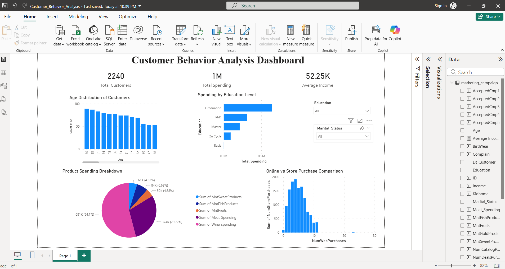

# Customer Behavior Analysis Dashboard

## 📊 Project Overview

This project presents a Power BI dashboard that analyzes customer purchasing behavior using marketing campaign data. The goal of this project is to understand customer demographics, spending patterns, and purchasing channels to derive meaningful business insights.

## 📁 Dataset

The dataset used in this project contains customer demographic information, income details, product purchases, and marketing campaign responses.

Key attributes include:

* Customer ID
* Birth Year
* Education Level
* Marital Status
* Income
* Product Purchases
* Web Purchases
* Store Purchases

## 📈 Dashboard Features

* **Total Customers KPI** – Shows the total number of customers
* **Total Spending KPI** – Displays the overall spending by customers
* **Average Income KPI** – Indicates the average income level
* **Age Distribution** – Visualizes how customers are distributed by age
* **Spending by Education Level** – Compares spending across education categories
* **Product Category Spending** – Shows spending across product categories
* **Online vs Store Purchases** – Compares online and in-store purchasing behavior

## 🎛 Filters

* Education
* Marital Status

These filters allow users to interactively explore customer segments.

## 🛠 Tools & Technologies

* Power BI
* Data Visualization
* Data Analysis

## 📷 Dashboard Preview

## 📌 Key Insights

* Customers aged **50–60** form a large portion of the dataset.
* Customers with **Graduation level education contribute the highest spending**.
* **Wine products account for the highest spending category**.
* Online purchases are slightly higher than in-store purchases.

## 👨‍💻 Author

Gurrala Yashwanth Reddy
